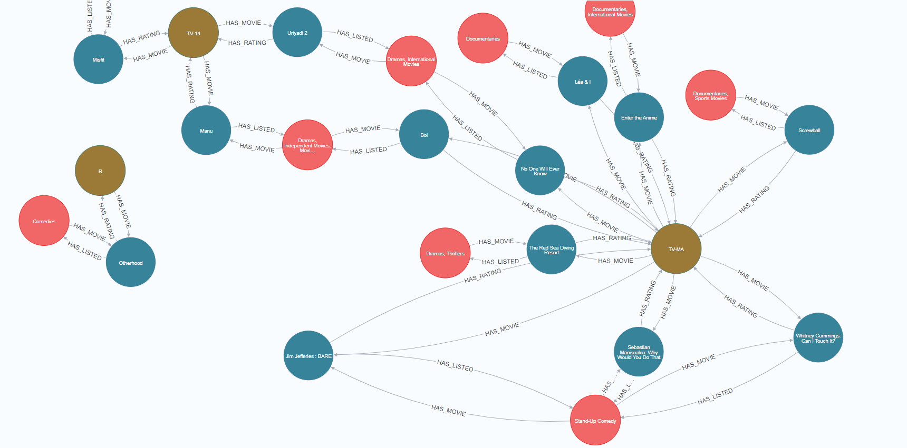
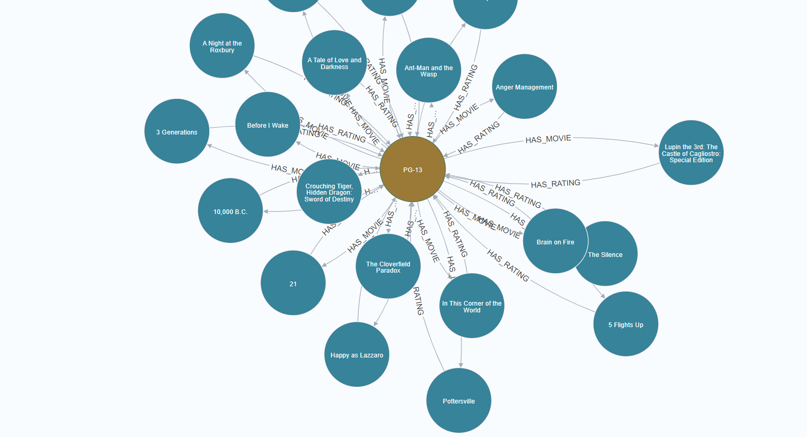
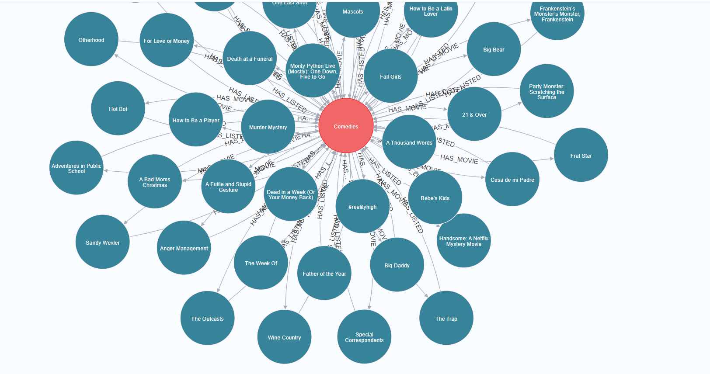

# GraphX: Machine learning and graph algorithms with graphDB

This project uses the kaggle Netflix Movies and TV Shows [dataset](https://www.kaggle.com/code/lakshyadeepikap/netflix-movies-and-tv-shows/data?select=netflix_titles.csv). This dataset is imported using the original csv format and a graph database is generated using the csv data.

* Steps
```
0. download the dataset into the directory: data/netflix_titles  

1. To Run the container  

    docker-compose up -d   (not yet tested this)
    docker-compose up   -> can run the container continuously using the start.sh command "neo4j console"
    docker-compose up --force-recreate --build -d
```



* Relationships 



